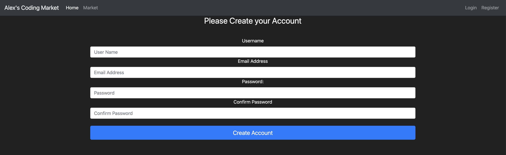

# Market
Online market website built with Flask framework.

Front-end is proudly supported by [Bootstrap](https://getbootstrap.com/docs/5.1/getting-started/introduction/).

Register page example:



## Local deployment
To run the project, in the top-level folder, run the following command:

```
python3 run.py 
```
The result should look as follows:
```
% python3 run.py
 * Serving Flask app 'market'
 * Debug mode: on
WARNING: This is a development server. Do not use it in a production deployment. Use a production WSGI server instead.
 * Running on http://127.0.0.1:5000
Press CTRL+C to quit
 * Restarting with stat
 * Debugger is active!
 * Debugger PIN: 269-023-406
```
Navigate in your web browser to ```http://127.0.0.1:5000``` and feel free to use the website!
